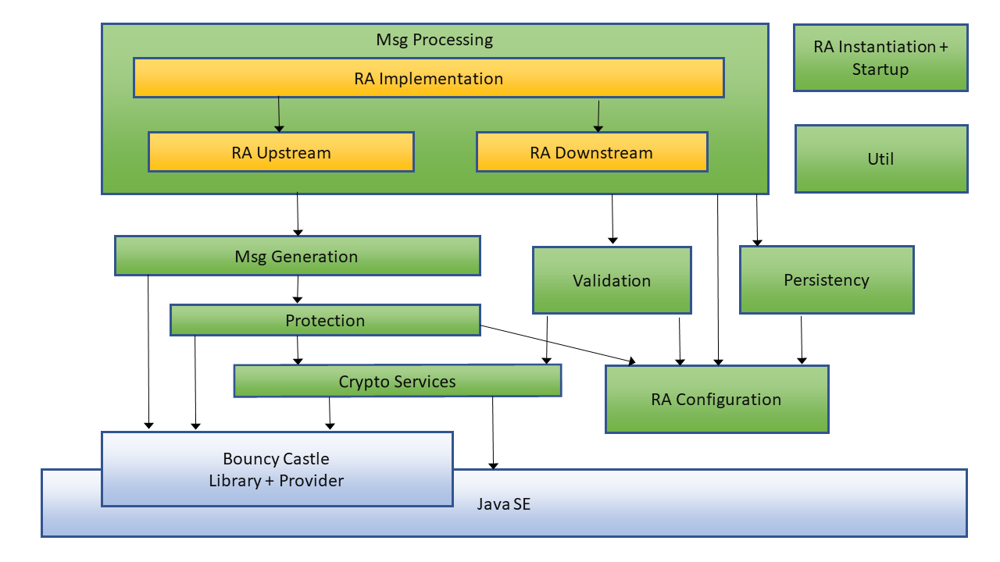
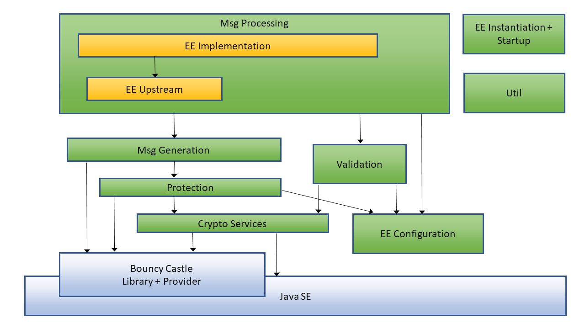

<!--- License: Apache 2.0 -->

# Features of the generic CMP RA component

The generic CMP RA component supports the implementation of applications
that provide CMP Registration Authority (RA) functions.
It implements the RA features specified in the
[Lightweight Certificate Management Protocol (CMP) Profile](
https://datatracker.ietf.org/doc/draft-ietf-lamps-lightweight-cmp-profile/),
reflecting the updates to CMP (RFC 4210) and CRMF (RFC 4211) given in
[Certificate Management Protocol (CMP) Updates](
https://datatracker.ietf.org/doc/draft-ietf-lamps-cmp-updates/)
and [Certificate Management Protocol (CMP) Algorithms](
https://datatracker.ietf.org/doc/draft-ietf-lamps-cmp-algorithms/).

## Basic features for use in PoCs, reference implementations, and in production

* The generic RA component implements the following CMP functions and features:
    * Build, parse, and process CMP messages and validate their contents.
    * Validate, modify, and add CMP message protection,
      based on signatures or shared secrets (MAC).
    * Support all CMP use cases (including ir, cr, p10cr, kur, rr, and
    nested messages) defined in the [Lightweight CMP Profile](https://datatracker.ietf.org/doc/html/draft-ietf-lamps-lightweight-cmp-profile).
    * Support all general CMP features defined in Lightweight CMP Profile,
      including error handling within CMP, local/central key generation,
      and delayed delivery of all message types.
* The component is usable in server contexts and in standalone applications.
* Use of the component is as simple as possible,
  not requiring specific (crypto, CMP, etc.) detailed knowledge.
* The component supports very flexible configuration,
  allowing to set all relevant options, with reasonable defaults.
* The component provides error reporting and logging
  towards embedding application or execution environment.
* All messages are ASN.1 DER-encoded for maximal interoperability.
* The component allows using any type of message transfer, such as HTTP(S).
* Message transfer supports also asynchronous delivery.
* Java interface is based on Bouncy Castle (low-level CMP)
  and the Java crypto provider (JCE).

## Advanced features, in particular for productive use

* The generic CMP RA component is usable as servlet
  in typical web server frameworks, such as Tomcat.
* The Configuration interface of the generic CMP RA component supports
  setting options also dynamically and dependent on certificate profiles.
* The upstream message transfer interface of the component
    * provides optional routing information dependent on the certificate profile
    * supports legacy servers by using PKCS#10 requests
      and X.509 responses as alternative to CMP.
* The component has an interface for authorizing and optionally
  modifying certificate requests (e.g., using an external inventory).
* The component has an interface for reporting (also intermediate)
  enrollment state to external entities (e.g., inventory).
* The component has an interface for persisting internal state
  (e.g., using a database) supporting long-lasting transactions with
  application recovery, to support restart on failure and load balancing.

# Structure of the generic CMP RA component

The picture below shows the overall design and relation to JAVA base components:

## Overall software design

* The API for instantiating an CMP RA component is specified as Java interfaces.
* The API to access the generic CMP RA component is based just on common
  Java libraries and runtime environment, including Java crypto provider (JCE).
* Errors, warnings and information on internal message processing are logged
  using the framework [SLF4J](http://www.slf4j.org/).
* The implementation uses internally the
  [Bouncy Castle library](https://www.bouncycastle.org/),
  which providesd a low-level CMP implementation.
* As far as possible, errors are reported at application level
  as CMP error messages.
  Otherwise Java exceptions are thrown,
  also in case of invalid configuration and on other fatal errors.

## Message exchange API design

For simplicity, there is only one downstream interface towards clients (EEs)
and one upstream interface towards server (CA).
In case multiple downstream or upstream interfaces are desired:
* Differentiation in transport/routing
  can be achieved by the embedding application multiplexing channels.
* Differentiation in message protection or inventory behavior
  can be achieved via the certificate profile mechanism.
* If any further differentiation in CMP/application-level processing
  is required, multiple RA instances are needed.

All messages, also PKCS#10 and X.509 structures,
are exchanged as ASN.1 DER-encoded byte strings.
* The transfer layer typically does not need to look into
  the contents of the request/response messages
  but can simply forward and return them as opaque data.
* The byte-string level is the least common denominator
  for representing PKIX-related data structures.
  Using it avoids the error-prone handling of inadequate class definitions
  provided by the standard Java RE.
 
The transport layer in the embedding RA server application
is responsible for the following:
* Extract request message received from the client side and
  feed them the to RA downstream interface.
* Forward request message provided by the RA upstream interface
  towards the server.
* Collect response messages from server side and
  provide them to the RA upstream interface.
* Take resulting response message from the RA downstream interface and
  return it to the client.

## Component and interface design

The embedding application does not need to know CMP specifics.
It can regard incoming and outgoing CMP messages
simply as opaque Java byte arrays.
The externally usable interface is specified in [`com.siemens.pki.cmpracomponent.main.CmpRaComponent`](src/main/java/com/siemens/pki/cmpracomponent/main/CmpRaComponent.java).

The UML diagram [component and interface design](doc/componentandinterfacedesignra.uml)
gives an overview about external components and interactions.

### Dynamic message exchange behavior on the downstream CMP interface and upstream PKCS#10/X.509 interface

In the PKCS#10 case the upstream communication (towards the CA) is synchronous.
The UML diagram [Sequence diagram for PKCS#10/X.509](doc/Sequence_instantiateP10X509CmpRaComponent.uml)
gives an overview about instantiation and message exchange
between CMP RA component, downstream interface and upstream interface:

 

1.	The "Configuration Interface" activates the "Downstream Interface" when instantiating the "RA Component" by calling the instantiateP10X509CmpRaComponent() method.
2.	The "Downstream Interface" sends a DER-encoded CMP p10cr as a byte array to the "RA Component" by calling the Function<byte[], byte[]> method.
3.	The "RA Component" activates the "Upstream Interface" by calling the upstreamP10X509Exchange method with a byte array containing a DER-encoded PKCS#10 CSR and a certificate profile.
4.	The "Upstream Interface" processes the request, returning a byte array containing an X.509 certificate response to the "RA Component."
5.	The "RA Component" then responds to the Function<byte[], byte[]> method call of the "Downstream Interface" in step 2 with a byte array response containing an CMP cp message.
Overall, the diagram details the method calls and message exchanges involved in the interaction between the "Configuration Interface," "Downstream Interface," "RA Component," and "Upstream Interface" for certificate management operations.

### Dynamic message exchange behavior for downstream and upstream CMP interface

In this case the upstream CMP communication (towards the CA)
may be synchronous and/or asynchronous.
The UML diagram
[Sequence diagram for CMP](doc/Sequence_instantiateCmpRaComponent.uml)
gives an overview about instantiation and message exchange
between CMP RA component, downstream interface, and upstream interface:

The diagram outlines an interaction between components in a system, involving the "Configuration Interface", "Downstream Interface", "RA Component", and "Upstream Interface". Here's a detailed breakdown of the steps involved:
1.	The "Configuration Interface" activates the "Downstream Interface" to instantiate the "RA Component" by calling the instantiateCmpRaComponent() method.
2.	The "Downstream Interface" sends a DER-encoded CMP request to the "RA Component" using the processRequest() method.
3.	The "RA Component" activates the "Upstream Interface" to perform the upstreamExchange operation with a DER-encoded CMP request and a certificate profile.
4.	If the interaction is synchronous, the "Upstream Interface" directly sends a DER-encoded CMP response to the "RA Component," which then responds to the "Downstream Interface" with a DER-encoded CMP response using the processRequest() method.
5.	If the interaction is asynchronous with delayed delivery, the "Upstream Interface" sends a null response to the "RA Component" due to the absence of the response. The "RA Component" then responds to the "Downstream Interface" with DER-encoded CMP cr/ir/kur/error response indicating a waiting indication.
6.	In a loop, the "Downstream Interface" sends a DER-encoded CMP polling request to the "RA Component," which responds with a DER-encoded CMP polling poll response.
7.	If the "Upstream Interface" got a DER-encoded CMP response by calling gotResponseAtUpstream() the "RA Component" responds DER-encoded CMP response to the "Downstream Interface."

## Configuration interface design

* Each RA instance is controlled by providing an implementation of the
[RA configuration interface](src/main/java/com/siemens/pki/cmpracomponent/configuration/Configuration.java).
* The configuration interface has a nested hierarchy of configuration items:
    * Verification context (trusted root certificates,
      intermediate certificates, certificate verification options,
      and options for CRL-based and OCSP-based certificate status checking;
      optionally also shared secrets)
    * Credential context (a private key with corresponding certificate
      and its chain; optionally also shared secrets) 
    * Inventory interface, can be used for authorizing, modifying, and logging
      certificate management operations 
    * Persistence interface, used to encode pending RA activity
      as a dynamic map of transaction IDs to messages
* The embedding application needs to
  provide getter methods for primitive and nested items.
    * It may take required data from a static configuration file
      and credential file contents.
    * It is responsible for protecting integrity and/or confidentiality
      of the configuration items as far as needed.
* The getter functions are called in the moment configuration items are needed,
  which supports dynamic changes.
    * Where appropriate, they may depend on a certificate profile
      optionally given in CMP request headers.
* If accessing the configuration interface shall be logged, the SLF4J-Logger of
  com.siemens.pki.cmpracomponent.util.ConfigLogger must be set to DEBUG, e.g.
  start with 
  -Dorg.slf4j.simpleLogger.log.com.siemens.pki.cmpracomponent.util.ConfigLogger=debug 

## Interfaces to inventory for certification request validation
and status updates, and for persistency

* The interface to an external inventory component is specified in
  [InventoryInterface](src/main/java/com/siemens/pki/cmpracomponent/configuration/InventoryInterface.java).
* The interface to an external persistency provider is specified in
  [PersistencyInterface](src/main/java/com/siemens/pki/cmpracomponent/configuration/PersistencyInterface.java).
* Implementations of both interfaces are part of the
  [configuration parameter](src/main/java/com/siemens/pki/cmpracomponent/configuration/Configuration.java)
  given at CMP RA component instantiation in
  [`com.siemens.pki.cmpracomponent.main.CmpRaComponent`](src/main/java/com/siemens/pki/cmpracomponent/main/CmpRaComponent.java).

## Javadoc API documentation

After the javadoc documentation has been generated locally by invoking
`mvn javadoc:javadoc`, it can be found
at `target/site/apidocs/com/siemens/pki/cmpracomponent/main/CmpRaComponent.html`.

# Features of the generic CMP client component

The client extends the
[generic CMP RA component](#features-of-the-generic-cmp-client-component).
It implements the End Entity features specified in the
[Lightweight Certificate Management Protocol (CMP) Profile](
https://datatracker.ietf.org/doc/draft-ietf-lamps-lightweight-cmp-profile/)
reflecting the updates to CMP (RFC 4210) and CRMF (RFC 4211) given in
[Certificate Management Protocol (CMP) Updates](
https://datatracker.ietf.org/doc/draft-ietf-lamps-cmp-updates/)
and [Certificate Management Protocol (CMP) Algorithms](
https://datatracker.ietf.org/doc/draft-ietf-lamps-cmp-algorithms/).

## Basic feature​s for use in PoCs, reference implementations, and in production

* The generic CMP client component component implements
the following CMP functions and features:
    * Build, parse, and process CMP messages and validate their contents.
    * Provide and validate CMP message protection,
      based on signatures or shared secrets (MAC).
    * Support all CMP use cases (including ir, cr, p10cr, kur, and rr)
      defined in the [Lightweight CMP Profile](
      https://datatracker.ietf.org/doc/html/draft-ietf-lamps-lightweight-cmp-profile).
    * Support all general CMP features defined in Lightweight CMP Profile,
      including error handling within CMP, local/central key generation,
      and delayed delivery of all message types.
* The component is usable in client contexts and in standalone applications.
* Use of the component is as simple as possible,
  not requiring specific (crypto, CMP, etc.) detailed knowledge.
* The component supports very flexible configuration,
  allowing to set all relevant options, with reasonable defaults.
* The component provides error reporting and logging
  towards embedding application or execution environment.
* All messages are ASN.1 DER-encoded for maximal interoperability.
* The component allows using any type of message transfer, such as HTTP(S).
* Java interface is based on Bouncy Castle (low-level CMP)
  and the Java crypto provider (JCE).

## Advanced features, in particular for productive use

* The Configuration interface of the generic CMP client component supports
  setting options also dynamically and dependent on certificate profiles in a
  similar way as for the CMP RA component.
* The message transfer interface of the component provides
  optional routing information dependent on the certificate profile

# Structure of the generic CMP client component

The picture below shows the overall design and relation to JAVA base components:

## Overall software design

* The API for instantiating an CMP client component is specified as a Java class.
* The API to access the generic CMP client component is based just on common
  Java libraries and runtime environment, including Java crypto provider (JCE).
* Errors, warnings and information on internal message processing are logged
  using the framework [SLF4J](http://www.slf4j.org/).
* The implementation uses internally the
  [Bouncy Castle library](https://www.bouncycastle.org/),
  which providesd a low-level CMP implementation.
* Errors are reported as Java exceptions,
  also in case of invalid configuration and on other fatal errors.

## Message exchange API design

For simplicity, there is only one upstream interface towards server (CA).
In case multiple upstream interfaces are desired:
* Differentiation in transport/routing
  can be achieved by the embedding application multiplexing channels.
* Differentiation in message protection or inventory behavior
  can be achieved via the certificate profile mechanism.
* If any further differentiation in CMP/application-level processing
  is required, multiple CMP client instances are needed.

All CMP messages are exchanged as ASN.1 DER-encoded byte strings.
* The transfer layer typically does not need to look into
  the contents of the request/response messages
  but can simply forward and return them as opaque data.
* The byte-string level is the least common denominator
  for representing PKIX-related data structures.
  Using it avoids the error-prone handling of inadequate class definitions
  provided by the standard Java RE.

The transport layer in the embedding client application
is responsible for the following:
* Forward request message provided by the client upstream interface
  towards the server.
* Collect response messages from server side and
  provide them to the client upstream interface.

## Component and interface design

The embedding application does not need to know CMP specifics.
It can regard incoming and outgoing CMP messages
simply as opaque Java byte arrays.
The externally usable interface is specified in [`com.siemens.pki.cmpclientcomponent.main.CmpClient`](src/main/java/com/siemens/pki/cmpclientcomponent/main/CmpClient.java).

The UML diagram [component and interface design](doc/componentandinterfacedesignclient.uml)
gives an overview about external components and interactions.

### Dynamic message exchange behavior for downstream and upstream CMP interface

The UML diagram [Sequence diagram for CMP](doc/Sequence_instantiateCmpClientComponent.uml)
gives an overview about instantiation and message exchange
between CMP Client component and upstream interface:

The diagram describes the interaction between an "Embedding Application" and a "Client Instance" using the "UpstreamExchange interface" to perform actions related to certificate management. Here's a detailed explanation of the steps involved in the interaction:
1.	The "Embedding Application" activates and interacts with the "Client Instance" to perform certificate management operations.
2.	The "Client Instance" interacts with the "UpstreamExchange interface" to send and receive messages related to certificate management.
3.	The "Embedding Application" makes a synchronous call to the "Client Instance" to execute the getCACertificates(), getCertificateRequestTemplate(), getCRLs(), getRootCACertificateUpdate(), invokeEnrollment(), or invokeRevocation() methods.
4.	The "Embedding Application" sends a request to the "Client Instance" to invoke the CmpClient method.
5.	The "Client Instance" interacts with the "UpstreamExchange interface" to send and receive messages using the sendReceiveMessage() method. This includes sending a request with specific parameters and receiving a response.
6.	If the communication is synchronous, the "UpstreamExchange interface" directly sends a response to the "Client Instance". If it's asynchronous, there may be a delayed delivery, and the response includes a waiting indication.
7.	In the case of asynchronous communication, the "Client Instance" loops back to the "UpstreamExchange interface" to send a poll request and receive a poll response until the response is received.
8.	After successful enrollment without implicit confirmation, the "Client Instance" sends a certificate confirmation, and the "UpstreamExchange interface" responds with a PKI confirmation.
9.	The "Client Instance" then sends the response of the method call back to the "Embedding Application".

## Configuration interface design

* Each CMP client instance is controlled by providing implementations of
  * [`com.siemens.pki.cmpclientcomponent.main.CmpClient.ClientContext`](src/main/java/com/siemens/pki/cmpclientcomponent/main/CmpClient.java)
  * [`com.siemens.pki.cmpracomponent.main.CmpRaComponent.UpstreamExchange`](src/main/java/com/siemens/pki/cmpracomponent/main/CmpRaComponent.java) and
  * [`com.siemens.pki.cmpracomponent.configuration.CmpMessageInterface`](src/main/java/com/siemens/pki/cmpracomponent/configuration/CmpMessageInterface.java)

For configuration interface details see [RA Configuration interface design](#configuration-interface-design) which is partly reused for client configuration.

## Acknowledgements

This work was partly funded by the German Federal Ministry of Education and Research in the project Quoryptan through grant number **16KIS2033**.
